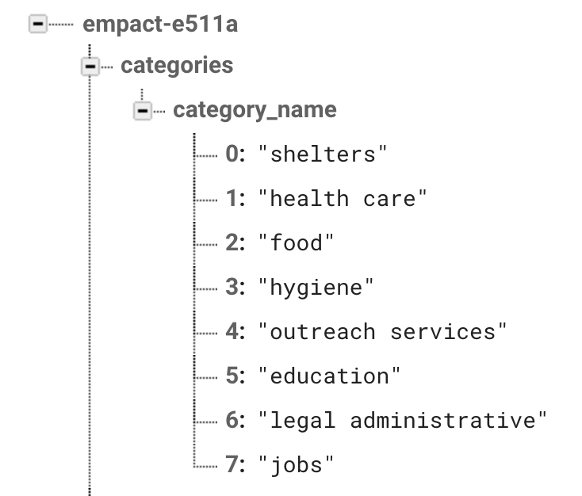
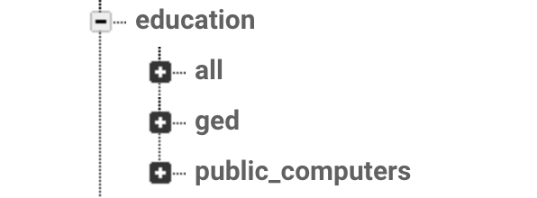
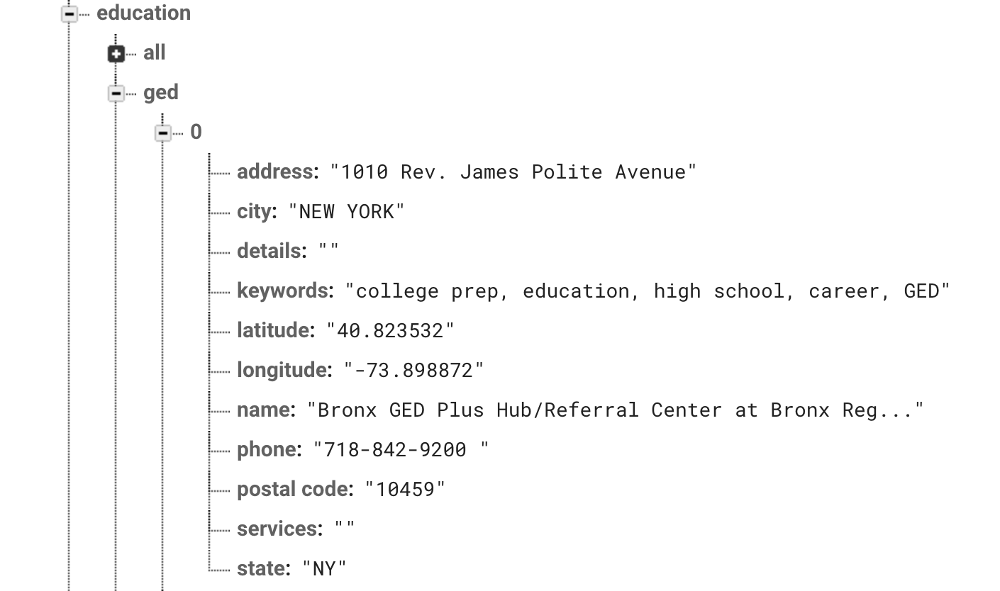

# EmPact API

## Introduction

## Table of Contents

- [Installation](#Installation)

* [API URL](#api-url)
* [Data set](#DATA-SET)
* [SCHEMA](#SCHEMA)
* [API endpoints](#API-ENDPOINTS)

---

# Overview

This readMe describes the back-end files and resources for the EmPact application. This repository was made during Lambda School's Labs Curriculum, where students work for 5 weeks on a collaborative and inter-disciplinary team to create a production-ready application. The EmPact Team consists of Full-Stack Web Developers, iOS developers, and a UX Designer. This repository is for the Backend.

---

# Installation #api-url

This backend database is hosted and served from Firebase at `https://empact-e511a.firebaseio.com/`.

---

# DATA-SET

All data in the firebase db was pulled from the NYC open source database found at https://opendata.cityofnewyork.us/ and aggregated for the purposes of this project at https://docs.google.com/document/d/1b9r0doZGJ54-Pje9AZyct9Bz_4Gi1xBaLZY-l409WeE/edit?usp=sharing. Of note, data uploads from the Firebase Console will overwrite any existing data in a given file. To upload to Firebase, you will import JSON files into your selected portion of the database or make `POST` calls from the front-end. To change existing data in the Firebase Console, you will need to export the existing JSON file, make and save changes, and then re-upload the altered JSON file. To make changes from the codebase, you may use firebase functions or `PUT` requests from the front-end. JSON files cannot be deleted from the Firebase Console. You may only delete an entire database, or export the database as JSON, remove the intended files, and re-upload your altered JSON. Alternatively, you may also use a standard `DELETE` https request from the front-end.

---

#SCHEMA

The database begins at the base endpoint `https://empact-e511a.firebaseio.com/`, and then has categories nested inside the 1st level of the database like according to the below image:



Categories then have sub-categories nested inside them according to the below image:



Each Sub-category has a list of individual resources nested inside it, and those resources each have the following fields as seen in the below image - address, city, details, keywords, latitude, longitude, name, phone, postal code, services, and state.



---

#API-ENDPOINTS

Each endpoint in the firebase database is based on the specific portion of the database to which the user is navigating, and can be called using any of `GET`, `POST`, `PUT`, or `DELETE` HTTPS requests. To receive a response that is formatted as a JSON, the endpoints will need to be appended with `.json`; EX. `https://empact-e511a.firebaseio.com/categories` will only return a JSON response when formatted as `https://empact-e511a.firebaseio.com/categories.json`. The endpoints are found at the following URLs:

categories names - `https://empact-e511a.firebaseio.com/categories`

## CATEGORIES:

Querying categories will follow this general structure:

```JS
https://empact-e511a.firebaseio.com/${category}
```

Example:

```JS
https://empact-e511a.firebaseio.com/education
```

## SUB-CATEGORIES:

Querying sub-categories will follow this general structure:

```JS
https://empact-e511a.firebaseio.com/${category}/${sub_category}
```

Example:

```JS
https://empact-e511a.firebaseio.com/education/ged
```

## SINGLE RESOURCES:

Querying single resources will follow this general structure:

```JS
https://empact-e511a.firebaseio.com/${category}/${sub_category}/${single_resource}
```

Example:

```JS
https://empact-e511a.firebaseio.com/education/ged/0
```

---
